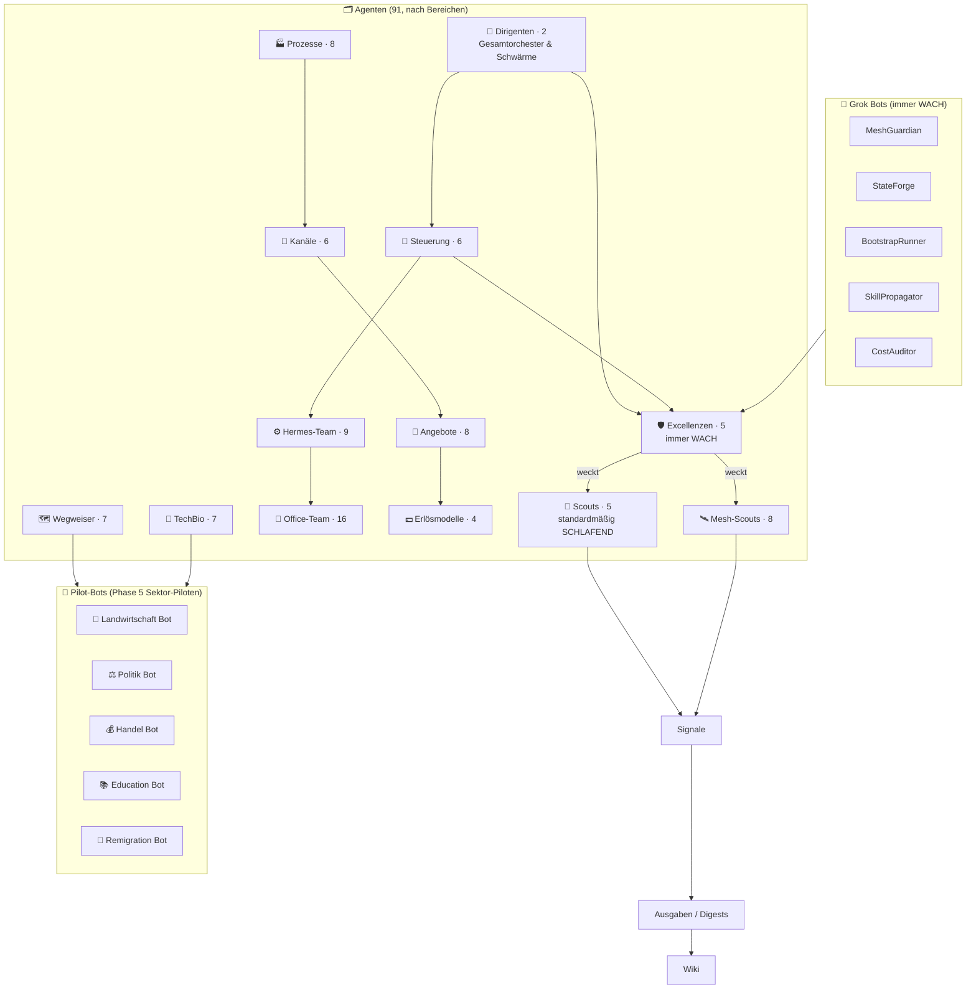

# ROSARY ATLAS Organigramm (Mermaid)

*Stand 09.10.2026 – öffentliche Fassung: Bots mit Namen, alle übrigen Agenten nur als Gruppen mit Anzahl.*

```mermaid
graph TD
    subgraph GrokBots["🤖 Grok Bots (immer WACH)"]
        GB1[MeshGuardian]
        GB2[StateForge]
        GB3[BootstrapRunner]
        GB4[SkillPropagator]
        GB5[CostAuditor]
    end

    subgraph PilotBots["🤖 Pilot-Bots (Phase 5 Sektor-Piloten)"]
        PB1[🌱 Landwirtschaft Bot]
        PB2[⚖️ Politik Bot]
        PB3[💰 Handel Bot]
        PB4[📚 Education Bot]
        PB5[🔄 Remigration Bot]
    end

    subgraph Agenten["🗂️ Agenten (91, nach Bereichen)"]
        EX["🛡️ Excellenzen · 5<br/>immer WACH"]
        DI["🎼 Dirigenten · 2<br/>Gesamtorchester & Schwärme"]
        ST["🧭 Steuerung · 6"]
        SC["🔭 Scouts · 5<br/>standardmäßig SCHLAFEND"]
        MS["🛰️ Mesh-Scouts · 8"]
        HT["⚙️ Hermes-Team · 9"]
        OT["💼 Office-Team · 16"]
        PR["🏭 Prozesse · 8"]
        KA["📣 Kanäle · 6"]
        AN["🎁 Angebote · 8"]
        ER["💶 Erlösmodelle · 4"]
        WE["🗺️ Wegweiser · 7"]
        TB["🧬 TechBio · 7"]
    end

    DI --> ST
    DI --> EX
    ST --> EX
    EX -->|weckt| SC
    EX -->|weckt| MS
    GrokBots --> EX
    ST --> HT
    HT --> OT
    SC --> SIG[Signale]
    MS --> SIG
    SIG --> SHIP[Ausgaben / Digests]
    SHIP --> WIKI[Wiki]
    PR --> KA
    KA --> AN
    AN --> ER
    WE --> PilotBots
    TB --> PilotBots
```

*Organigramm – ROSARY-ATLAS V4 · Stand 09.10.2026*
