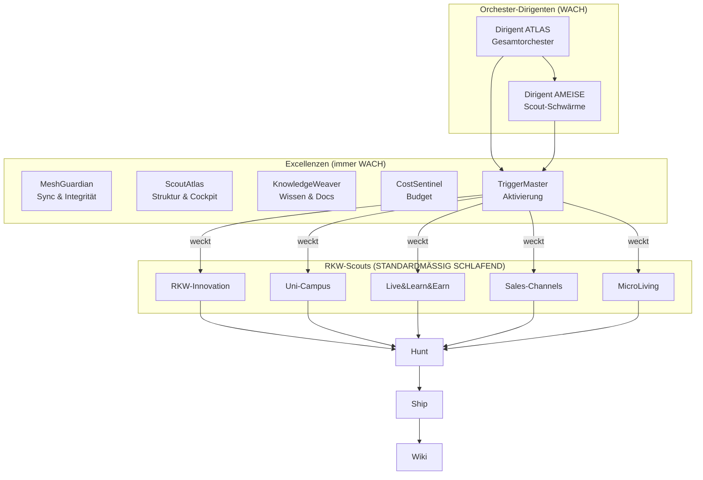

# ROSARY ATLAS Organigramm (Mermaid)

```mermaid
graph TD
    subgraph Excellenzen["Excellenzen (immer WACH)"]
        MG[MeshGuardian<br/>Sync & Integrität]
        SA[ScoutAtlas<br/>Struktur & Cockpit]
        KW[KnowledgeWeaver<br/>Wissen & Docs]
        CS[CostSentinel<br/>Budget]
        TM[TriggerMaster<br/>Aktivierung]
    end

    subgraph Dirigenten["Orchester-Dirigenten (WACH)"]
        ATLAS[Dirigent ATLAS<br/>Gesamtorchester]
        AMEISE[Dirigent AMEISE<br/>Scout-Schwärme]
    end

    subgraph Scouts["RKW-Scouts (STANDARDMÄSSIG SCHLAFEND)"]
        RKW[RKW-Innovation]
        UNI[Uni-Campus]
        LLE[Live&Learn&Earn]
        SC[Sales-Channels]
        ML[MicroLiving]
    end

    ATLAS --> AMEISE
    ATLAS --> TM
    AMEISE --> TM
    TM -->|weckt| RKW
    TM -->|weckt| UNI
    TM -->|weckt| LLE
    TM -->|weckt| SC
    TM -->|weckt| ML

    RKW --> Hunt
    UNI --> Hunt
    LLE --> Hunt
    SC --> Hunt
    ML --> Hunt

    Hunt --> Ship
    Ship --> Wiki
```

*Organigramm – ROSARY-ATLAS V4*