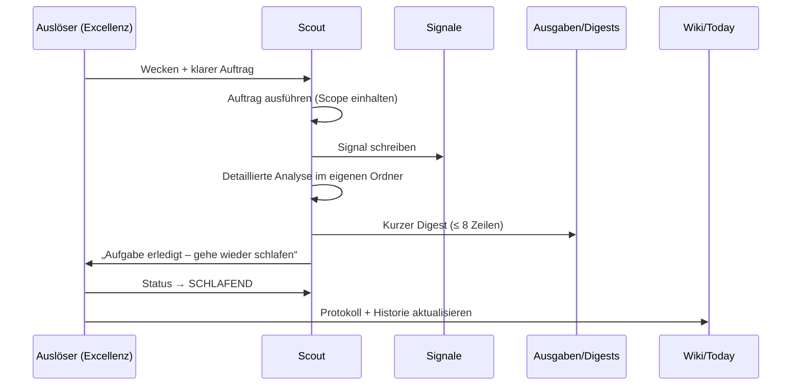

# Haupt-Loop: Trigger → Scout → Output → Sleep

```mermaid
sequenceDiagram
    participant TM as Auslöser (Excellenz)
    participant Scout as Scout
    participant Sig as Signale
    participant Ship as Ausgaben/Digests
    participant Wiki as Wiki/Today

    TM->>Scout: Wecken + klarer Auftrag
    Scout->>Scout: Auftrag ausführen (Scope einhalten)
    Scout->>Sig: Signal schreiben
    Scout->>Scout: Detaillierte Analyse im eigenen Ordner
    Scout->>Ship: Kurzer Digest (≤ 8 Zeilen)
    Scout->>TM: „Aufgabe erledigt – gehe wieder schlafen“
    TM->>Scout: Status → SCHLAFEND
    TM->>Wiki: Protokoll + Historie aktualisieren
```

*Haupt-Loop der Scout-Aktivierung – ROSARY-ATLAS V4 · Stand 09.10.2026*
