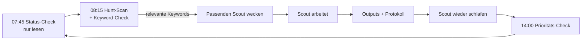

# Daily Cron-Loop (TriggerMaster)

```mermaid
flowchart LR
    A[07:45 Status-Check<br/>nur lesen] --> B[08:15 Hunt-Scan<br/>+ Keyword-Check]
    B -->|relevante Keywords| C[Passenden Scout wecken]
    C --> D[Scout arbeitet]
    D --> E[Outputs + Protokoll]
    E --> F[Scout wieder schlafen]
    F --> G[14:00 Prioritäts-Check]
    G --> A
```

*Daily Cron-Loop – ROSARY-ATLAS V4*