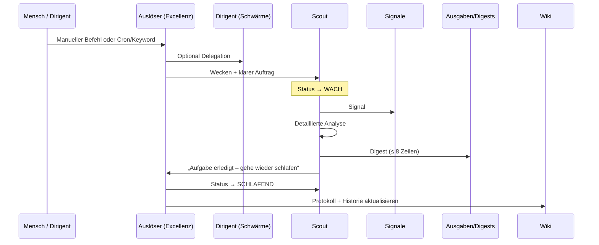

# Scout-Aktivierungs-Loop (Detail)

```mermaid
sequenceDiagram
    participant User as Mensch / Dirigent
    participant TM as Auslöser (Excellenz)
    participant DIR as Dirigent (Schwärme)
    participant Scout as Scout
    participant Sig as Signale
    participant Ship as Ausgaben/Digests
    participant Wiki as Wiki

    User->>TM: Manueller Befehl oder Cron/Keyword
    TM->>DIR: Optional Delegation
    TM->>Scout: Wecken + klarer Auftrag
    Note over Scout: Status → WACH
    Scout->>Sig: Signal
    Scout->>Scout: Detaillierte Analyse
    Scout->>Ship: Digest (≤ 8 Zeilen)
    Scout->>TM: „Aufgabe erledigt – gehe wieder schlafen“
    TM->>Scout: Status → SCHLAFEND
    TM->>Wiki: Protokoll + Historie aktualisieren
```

*Detaillierter Scout-Aktivierungs-Loop – ROSARY-ATLAS V4 · Stand 09.10.2026*
