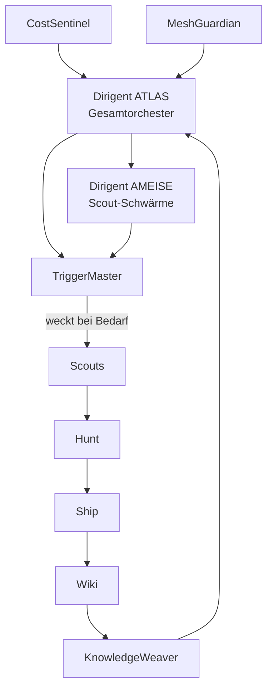
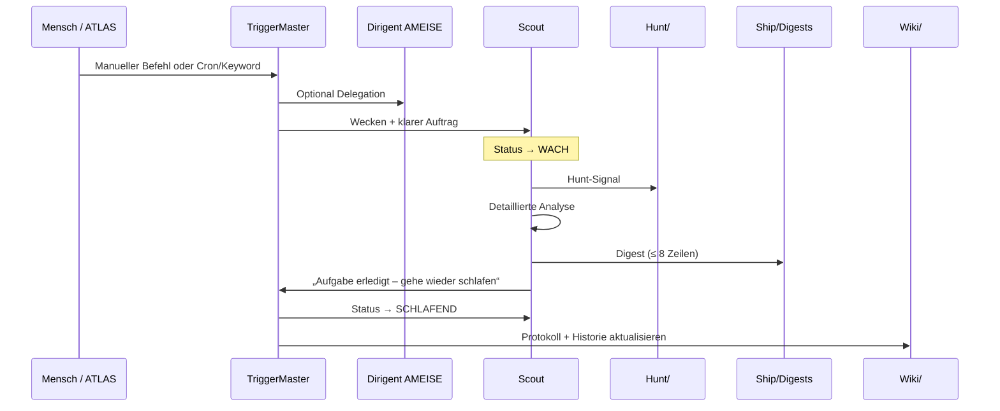

# Gesamt-Orchester-Loop (ATLAS + AMEISE + Excellenzen)

```mermaid
flowchart TD
    ATLAS[Dirigent ATLAS<br/>Gesamtorchester] --> AMEISE[Dirigent AMEISE<br/>Scout-Schwärme]
    ATLAS --> TM[TriggerMaster]
    AMEISE --> TM
    TM -->|weckt bei Bedarf| Scouts
    Scouts --> Hunt
    Hunt --> Ship
    Ship --> Wiki
    Wiki --> KnowledgeWeaver
    KnowledgeWeaver --> ATLAS
    CostSentinel --> ATLAS
    MeshGuardian --> ATLAS
```

```mermaid
sequenceDiagram
    participant User as Mensch / ATLAS
    participant TM as TriggerMaster
    participant AMEISE as Dirigent AMEISE
    participant Scout as Scout
    participant Hunt as Hunt/
    participant Ship as Ship/Digests
    participant Wiki as Wiki/

    User->>TM: Manueller Befehl oder Cron/Keyword
    TM->>AMEISE: Optional Delegation
    TM->>Scout: Wecken + klarer Auftrag
    Note over Scout: Status → WACH
    Scout->>Hunt: Hunt-Signal
    Scout->>Scout: Detaillierte Analyse
    Scout->>Ship: Digest (≤ 8 Zeilen)
    Scout->>TM: „Aufgabe erledigt – gehe wieder schlafen“
    TM->>Scout: Status → SCHLAFEND
    TM->>Wiki: Protokoll + Historie aktualisieren
```

*Gesamt-Orchester-Loop – ROSARY-ATLAS V4*