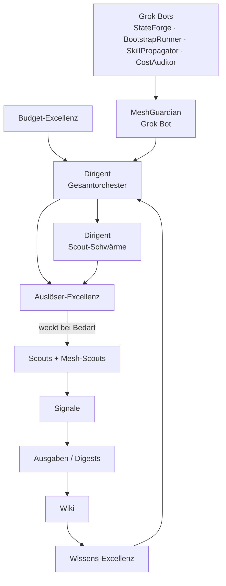
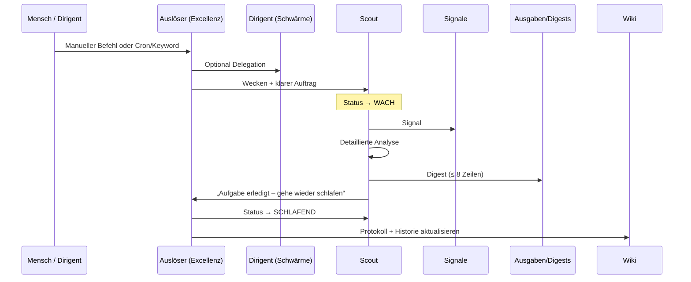

# Gesamt-Orchester-Loop (Dirigenten + Excellenzen + Grok Bots)

```mermaid
flowchart TD
    DIR1[Dirigent<br/>Gesamtorchester] --> DIR2[Dirigent<br/>Scout-Schwärme]
    DIR1 --> TM[Auslöser-Excellenz]
    DIR2 --> TM
    TM -->|weckt bei Bedarf| Scouts[Scouts + Mesh-Scouts]
    Scouts --> Sig[Signale]
    Sig --> Ship[Ausgaben / Digests]
    Ship --> Wiki
    Wiki --> KW[Wissens-Excellenz]
    KW --> DIR1
    CS[Budget-Excellenz] --> DIR1
    MG[MeshGuardian<br/>Grok Bot] --> DIR1
    GB[Grok Bots<br/>StateForge · BootstrapRunner · SkillPropagator · CostAuditor] --> MG
```

```mermaid
sequenceDiagram
    participant User as Mensch / Dirigent
    participant TM as Auslöser (Excellenz)
    participant DIR as Dirigent (Schwärme)
    participant Scout as Scout
    participant Sig as Signale
    participant Ship as Ausgaben/Digests
    participant Wiki as Wiki

    User->>TM: Manueller Befehl oder Cron/Keyword
    TM->>DIR: Optional Delegation
    TM->>Scout: Wecken + klarer Auftrag
    Note over Scout: Status → WACH
    Scout->>Sig: Signal
    Scout->>Scout: Detaillierte Analyse
    Scout->>Ship: Digest (≤ 8 Zeilen)
    Scout->>TM: „Aufgabe erledigt – gehe wieder schlafen“
    TM->>Scout: Status → SCHLAFEND
    TM->>Wiki: Protokoll + Historie aktualisieren
```

*Gesamt-Orchester-Loop – ROSARY-ATLAS V4 · Stand 09.10.2026*
